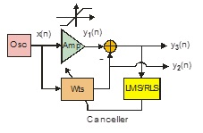
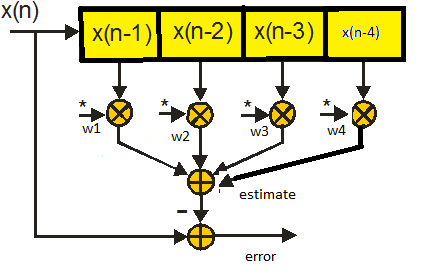
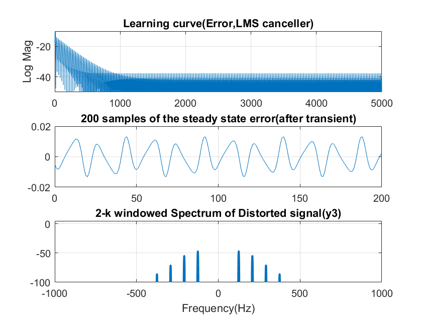
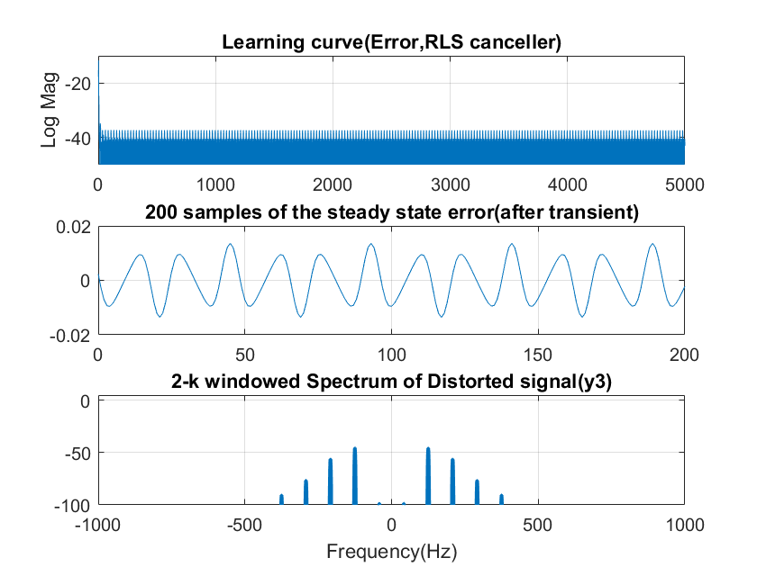
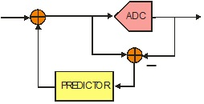
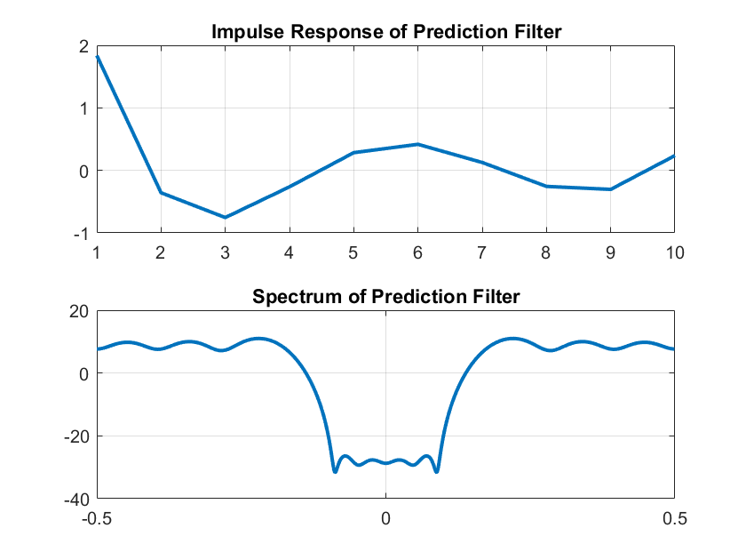
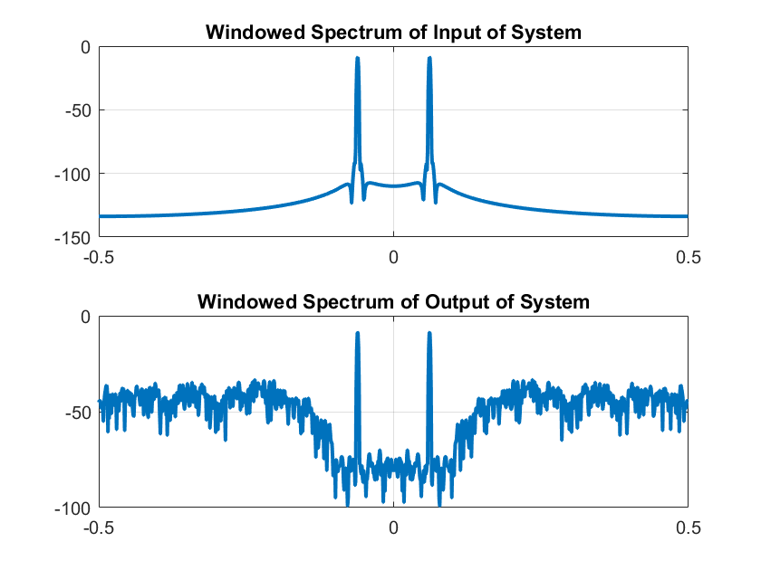
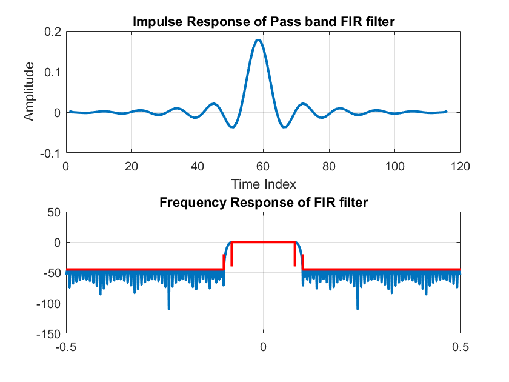
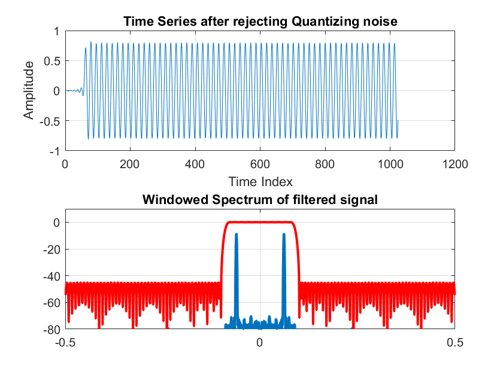

Adaptive Signal Processing
==========================

Total Harmonic distortion of Non-linear amplifier and Linear Prediction filter Srilakshmi Alla

819663423

Contents
--------

-   [Clearing Memory](#1)
-   [Model of the Non-linear Amplifier](#5)
-   [Non linear Transfer Function](#6)
-   [LMS Algorithm](#8)
-   [Total Harmonic Distortion of the amplifier](#11)
-   [Observation](#12)
-   [RLS Algorithm](#13)
-   [Total Harmonic Distortion of the amplifier](#14)
-   [Observation](#15)
-   [Prediction filter](#19)
-   [Noise Feedback Quantizer](#21)
-   [FIR filter design using Remez Algorithm](#23)
-   [Output after filtering out Quantizing noise](#24)

Clearing Memory
---------------

``` {.codeinput}
clc;
clear all;
close all;
```

The configuration given below is used to measure total harmonic distortion of an non-linear amplifier



The input signal is a 1-kHz sine wave sampled at 48 kHz of 5k length

``` {.codeinput}
x=sin(2*pi*1/48*(0:4999));
```

Model of the Non-linear Amplifier
---------------------------------

``` {.codeinput}
clip=1.3;
x_0=abs(x)/clip;
phi=angle(x);
y1=clip*(x_0./(1+x_0.^6).^(1/6)).*cos(phi);
```

Non linear Transfer Function
----------------------------

``` {.codeinput}
clip=1.3;
x_dat=0:0.02:2;
x_0=abs(x_dat)/clip;
y_dat=clip*(x_0./(1+x_0.^6).^(1/6));
```

One subplot showing the nonlinear transfer function,a second subplot showing 200 samples of input and output of non-linear amplifier, and on third subplot showing a 2-k windowed spectrum of the distorted signal.

``` {.codeinput}
figure;

subplot(3,1,1);
plot(x_dat,x_dat,'linewidth',2);
hold on;
plot(x_dat,y_dat,'r','linewidth',2);
plot([1 1]*clip,[0.80 1.1]*clip,'r','linewidth',2) ;
hold off;
grid on;
title('Nonlinear Transfer Function of Amplifier');
text(1.0,0.8,'1-dB Compression Point');

subplot(3,1,2);
plot(x(1:200));
hold on;
plot(y1(1:200));
hold off;
grid on;
title('200 samples of input and output of non-linear amplifier');

% Windowing
ww=kaiser(2000,10)';
ww=ww/sum(ww);

subplot(3,1,3);
plot((-0.5:1/2000:0.5-1/2000)*2000,fftshift(20*log10(abs(fft(y1(1:2000).*ww)))),'linewidth',2)
grid on;
axis([-1000 1000 -100 5]);
xlabel('Frequency(Hz)');
title('2-k windowed Spectrum of Distorted signal')
```


LMS Algorithm
-------------

On a sample by sample basis pass the input x, a unit amplitude sinewave of length 5-k, through the amplifier to form the signal y1. Also process the input signal in the 4-tap real LMS canceller (with mu=0.1). Two time series are available at the output of the canceller; y2 which is an estimate of the fundamental component at the output of the filter, and y3 which is the remaining signal components (i.e. harmonics) formed by the non-linearity. On one subplot show the learning curve, (log magnitude of the error (y3)), on the second subplot show 200 samples of the steady state error (after transient) and on the third subplot show a 2-k windowed spectrum of the distortion signal (y3). Determine the total harmonic distortion of the amplifier (100 \*  ).

4-tap real LMS canceller(with mu=0.1)

``` {.codeinput}
n_lms=4; % Length of LMS canceller

% Initialization
w_lms=zeros(1,n_lms)'; % Weights
x_lms=zeros(1,n_lms)'; % Register for updating values

mu=0.1;
```



This loop is built as per above block diagram

``` {.codeinput}
for nn=1:5000
    x_lms(2:n_lms)=x_lms(1:n_lms-1); % Sending input to register bit by bit
    x_lms(1)=x(nn);
    y2(nn)=w_lms'*x_lms;     % Estimate of input
    y3(nn)=y1(nn)-y2(nn); % Error between desired and predicted output
    w_lms=w_lms+mu*x_lms*conj(y3(nn)); % LMS Algorithm
end

figure;

subplot(3,1,1);
plot((20*log10(abs(y3))));
grid on;
axis([0 5000 -50 -10]);
ylabel('Log Mag');
title('Learning curve(Error,LMS canceller)');

subplot(3,1,2);
plot(0:200,y3(1000:1200));
grid on;
title('200 samples of the steady state error(after transient)')

% Windowing
ww=kaiser(2000,10)';
ww=ww/sum(ww);

subplot(3,1,3);
plot((-0.5:1/2000:0.5-1/2000)*2000,fftshift(20*log10(abs(fft(y3(3001:5000).*ww)))),'linewidth',2)
grid on;
axis([-1000 1000 -100 5]);
xlabel('Frequency(Hz)');
title('2-k windowed Spectrum of Distorted signal(y3)')
```



Total Harmonic Distortion of the amplifier
------------------------------------------

``` {.codeinput}
% THD of entire signal
thd_lms_full=100*((var(y3))/(var(y2)))

% THD of last 2000 samples where there is almost no distortion
thd_lms_last2000=100*((var(y3(3001:5000)))/(var(y2(3001:5000))))
```

``` {.codeoutput}
thd_lms_full =

    0.1620


thd_lms_last2000 =

    0.0100
```

Observation
-----------

THD is less for last 2000 samples where there is almost no distortion.THD is more for complete signal as there is distortion at the beginning.

RLS Algorithm
-------------

Repeat design with a 4-tap RLS canceller!

``` {.codeinput}
N_rls=4; % Length of RLS canceller

% Initialization
x_rls=zeros(1,N_rls)'; % Updating register bit by bit
W_rls=zeros(1,N_rls)'; % Weights

% Initial Conditions of RLS Algorithm
delta=0.01;    % Initial value
lambda=0.999;  % Forgetting factor (Memory).Depends on length of signal.
               % Since signal is 5000 samples,we have taken lambda as 0.999
P=(1/delta)*eye(N_rls);
y3=zeros(1,1000); % clearing memory

N_sig=5000 % Length of signal

% RLS Algorithm (Ref:RLStest1)

for n=1:N_sig

    C=P*x_rls;                         % Making co-efficient in g(n)
    G=C/(lambda+x_rls'*C);
    y2(n)=W_rls'*x_rls;                % estimate
    y3(n)=y1(n)-y2(n);                 % error
    W_rls=W_rls+G*conj(y3(n));         % Updating weights
    P=(1/lambda)*P -(1/lambda)*G*x_rls'*P;
    x_rls=[x(n); x_rls(1:N_rls-1)];    % Updating register

end

figure;

subplot(3,1,1);
plot((20*log10(abs(y3))));
grid on;
axis([0 5000 -50 -10]);
ylabel('Log Mag');
title('Learning curve(Error,RLS canceller)');

subplot(3,1,2);
plot(0:200,y3(1000:1200));
grid on;
title('200 samples of the steady state error(after transient)')

% Windowing
ww=kaiser(2000,10)';
ww=ww/sum(ww);

subplot(3,1,3);
plot((-0.5:1/2000:0.5-1/2000)*2000,fftshift(20*log10(abs(fft(y3(1:2000).*ww)))),'linewidth',2)
grid on;
axis([-1000 1000 -100 5]);
xlabel('Frequency(Hz)');
title('2-k windowed Spectrum of Distorted signal(y3)')
```

``` {.codeoutput}
N_sig =

        5000
```



Total Harmonic Distortion of the amplifier
------------------------------------------

``` {.codeinput}
% THD of entire signal
thd_rls_full=100*((var(y3))/(var(y2)))

% THD of last 2000 samples where there is almost no distortion
thd_rls_first2000=100*((var(y3(1:2000)))/(var(y2(1:2000))))
```

``` {.codeoutput}
thd_rls_full =

    0.0157


thd_rls_first2000 =

    0.0216
```

Observation
-----------

THD is less in first 2000 samples as RLS canceller is learning very fast.

A Noise Feedback Quantizer that that uses a 10-tap linear predictor of the form computed as solutions of the Normal Equations



Matlab script to design the prediction filter and form a figure showing the impulse response and its Spectra.

Prediction filter
-----------------

``` {.codeinput}
n_pred=10;
bw=0.20;
x1=(-n_pred*bw:bw:(2*n_pred-1)*bw/2);    % time sample locations
yy=sinc(x1);                     % Correlation Sequence
x2=(-n_pred:n_pred-1);
rr=zeros(n_pred,n_pred);  rd=zeros(1,n_pred);% Form Correlation Matrix rr and cross Correlation Vector rd
for n=1:n_pred
  rr(n_pred+1-n,:)=yy(n+1:n+n_pred);
  rd(n_pred+1-n)=yy(n);
end
add=10^(-3)*eye(n_pred,n_pred);  % add small term to Diagonal to raise matrix condition number
rrp=rr+add;
wts=inv(rrp)*conj(rd') ; % form filter weights
aa=[1 -wts'];
fwts=fftshift(20*log10(abs(fft([1 -wts'],1024)))); % Spectra

figure;
subplot(2,1,1);
plot(wts,'linewidth',2);
grid on;
title('Impulse Response of Prediction Filter');

subplot(2,1,2);
plot(-0.5:1/1024:0.5-1/1024,fwts,'linewidth',2);
grid on;
title('Spectrum of Prediction Filter');
```



The matlab code that implements the noise feedback loop shown above using a 4-bit ADC. Use an input signal which is 1024 samples of a 0.8 amplitude sinewave of frequency 0.06 and generate the 4-bit output sequence. Plot the input and output time series of the system as well as the windowed spectrum of the input and output time series.

Input signal to the system

``` {.codeinput}
x=(0.8)*sin(2*pi*0.061*(0:1023));
n_sig=1024; % Length of Signal
```

Noise Feedback Quantizer
------------------------

Noise Feedback loop using 4-bit ADC

``` {.codeinput}
n_pred=10;   % Length of Predictor
reg=zeros(1,n_pred);
qq=4;        % number of ADC bits
scl=2^(qq-2);
for nt=1:n_sig
    sm1=x(nt)+reg*wts;
    q_out=round(scl*sm1)/scl;
    n(nt)=q_out;
    err=sm1-q_out;
    reg=[err reg(1:n_pred-1)];
end

figure('Name','Input and Output Time Series','NumberTitle','off')
subplot(2,1,1);
plot(x(1:200),'linewidth',2);
grid on;
xlabel('Time');
title('Input Time Series of System');

subplot(2,1,2);
plot(n(1:200),'linewidth',2);
grid on;
xlabel('Time');
title('Output Time Series of System');

% Windowing
ww=kaiser(1024,10)';
ww=ww/sum(ww);

figure('Name','Input and Output Spectrum','NumberTitle','off');
subplot(2,1,1);
plot(-0.5:1/1024:0.5-1/1024,fftshift(20*log10(abs(fft(x.*ww)))),'linewidth',2);
grid on;
title('Windowed Spectrum of Input of System');

subplot(2,1,2);
plot(-0.5:1/1024:0.5-1/1024,fftshift(20*log10(abs(fft(n.*ww)))),'linewidth',2);
grid on;
title('Windowed Spectrum of Output of System');
```

 

Design of a FIR filter using the Remez algorithm to reject the quantizing noise in the output of this system. Filter the output series and show the filtered time series and its widowed spectrum.

FIR filter design using Remez Algorithm
---------------------------------------

In this case we need to preserve the signal from 0 to 0.08 and reject quantizing noise which starts from 0.1.

Order is calculated using formula (fs/df)\*(A(dB)/22). Output of Noise Feedback Quantizer is around -40dB.We designed a filter which will induce 40dB more attenuation so that noise will be below 80dB attenuation.

``` {.codeinput}
hl=remez(115,[0 0.08 0.1 0.5]*1024/512,[1 1 0 0]);

figure;
% Impulse Response

subplot(2,1,1);
plot(hl,'linewidth',2);
grid on;
title('Impulse Response of Pass band FIR filter');
xlabel('Time Index');
ylabel('Amplitude');

% Frequency Response

subplot(2,1,2)
plot((-0.5:1/1024:0.5-1/1024),fftshift(20*log10(abs(fft(hl,1024)))),'linewidth',2)
hold  on;
plot([-0.08 -0.08 0.08 0.08],[-40 0 0 -40],'r','linewidth',2)
plot([-0.5 -0.1 -0.1],[-45 -45 -20],'r','linewidth',2)
plot([+0.5 +0.1 +0.1],[-45 -45 -20],'r','linewidth',2)
hold off;
grid on;
title('Frequency Response of FIR filter')
```



Output after filtering out Quantizing noise
-------------------------------------------

``` {.codeinput}
yl=filter(hl,1,n);

figure;

% Impulse Response
subplot(2,1,1);
plot(yl);
grid on;
title('Time Series after rejecting Quantizing noise');
xlabel('Time Index');
ylabel('Amplitude');

% Frequency Response
subplot(2,1,2)
plot((-0.5:1/1024:0.5-1/1024),fftshift(20*log10(abs(fft(yl.*ww,1024)))),'linewidth',2)
hold on;
plot((-0.5:1/1024:0.5-1/1024),fftshift(20*log10(abs(fft(hl,1024)))),'r','linewidth',2)
hold off;
grid on;
axis([-0.5 0.5 -80 10]);
title('Windowed Spectrum of filtered signal');
```



We can see that Quantizing noise is almost rejected.

[Published with MATLAB® R2017a](http://www.mathworks.com/products/matlab/)

